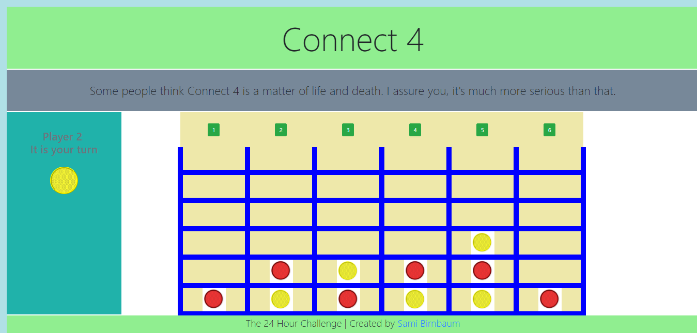

# Connect 4

## The 24 Hour Challenge!

Build a game of connect 4 from scratch in 24 hours.

[Visit Site](https://evening-lowlands-83392.herokuapp.com/)

[Case Study](https://samibirnbaum.com/portfolio/connect4.html)

## Usage

1. Fork and clone the repo: `git clone https://github.com/samibirnbaum/connect-4.git`
2. Run `$ npm install` to download/install the needed dependencies
3. Start the node server: `npm start`.
4. Open a web browser and go to `http://localhost:8080`.